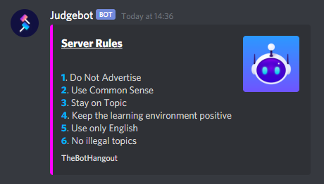
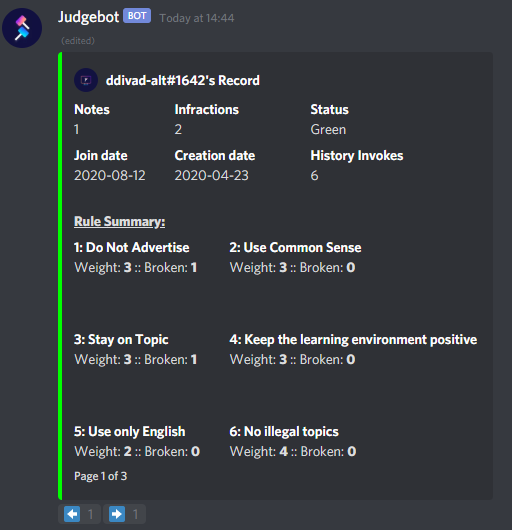

# Current Judgebot Functionality

## Commands Implemented:

## Rules:
Judgebot implements a Rules system that is used for infractions, but can also serve to show the rules in a guild. In Judgebot, every infraction needs to be tied to a broken rule. The rule text for the broken rule is sent to the user in their infraction embed, and the user history shows all the rules that have been broken by them in the main screen, along with the number of times.

### Rules List
A short list view of the server's rules, that can be linked to a website for the long version.

### Detailed Rules:
A detailed view of the rules in the server.

### Rule Breakdown:
A breakdown of the rule text for a given rule. May be useful in chat to remind a user of a given rule.

### Adding a new rule:
Rules can be added using the Createrule command. This triggers a conversation with the user to add a new rule to the guild. Rules are updated in a similar way, and can also be deleted.

## Infractions:
Judgebot's infraction system was designed to take bias out of the infraction process, and to simplify an infraction down to "A user has broken a rule, lets punish them for breaking that rule". The infraction system does not show previous infraction notes, only rules broken previously, and also automates the weight of the infraction. The moderator issuing the infraction will not know what sort of punishment will be dealed out to the rule breaker, so this will not affect their judgement when infracting (takes away the "user is on 2 strikes, if I strike them again they're banned. Lets warn them instead" dilema).

### User Status:
Instead of the 3 strike system in Hotbot, Judgebot operates on a points and status system. A user starts with 0 points. When a user infracted, points are added to their profile based on the weight of the rule and the weight the moderator infracts them. Rule weights range from 1 - 5, and moderator weights range from 0 - 4 (0 being a warning that won't add points). When a user gets points added, they get punished based on the points threshold they are on. When they achieve max points in this system, they are banned permantley from the guild.

Based on the number of points, a user is given a colour status (Clear, Green, Orange, Red). This status is to show the moderator how close the user is to being permanently banned (without showing them how close).

**Example of Green status with 2 infractions:**

### History:
The Histort embed has been changed to show a breakdown of the rules they have broken previously. To avoid the long embed like Hotbot, the Judgebot history is a Menu that is split across multiple pages. 

The first page shows the user overview (Notes, Inftaction, History Invokes, Status, etc...) and the rules summary, which shows the rules and what rules the user has previously broken.

Page 2 of the history shows Notes that the user has. By default, 5 notes will be shown, and if there are more than 5 notes for a user, another page will be added here.

Page 3 (or higher, depending on # of notes) shows the user's join/leave history in the guild.

### Logging
All punishments and infractions are logged to allow staff members to see the outcome of the infractions (as the infraction flow is done via conversations).

